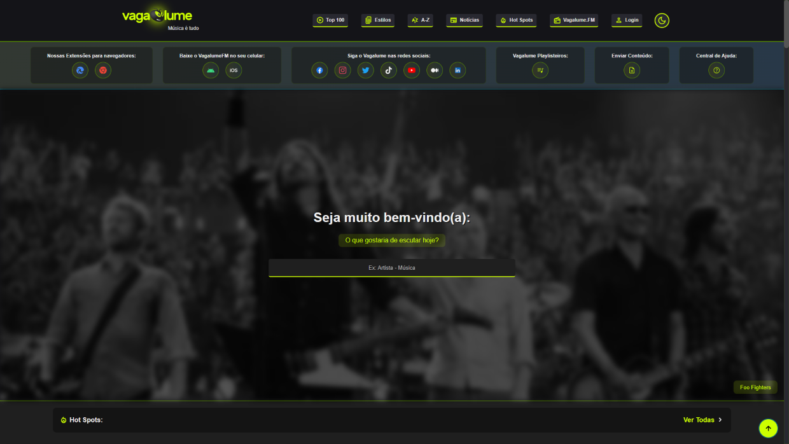
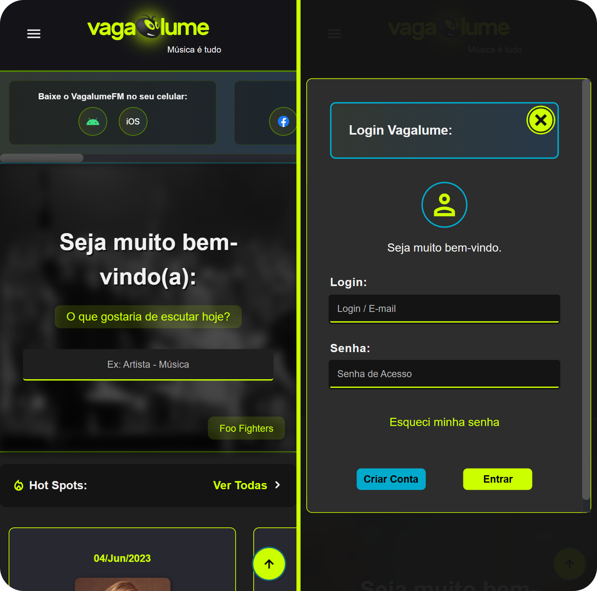

 

<h1 align="center">Estudo de Design: Vagalume</h1>

> Um projeto de estudo de Design sobre o site vagalume.com.br utilizando-se da API do mesmo.

## Sobre o Projeto:

 

<small>Imagem da versão Desktop.</small>

 

Este projeto possui como objetivo (além de servir de portfólio para uma oportunidade na área de desenvolvimento), servir como um projeto de estudos sobre Design e como se consumir uma API na prática além é claro de tentar entregar um projeto em estado “Finalizado” (ou quase isso).

Tendo isto em vista tentei adicionar os principais endpoints da API afim de testar algumas possibilidades ao mesmo tempo em que tentei entregar um Design próprio para testar as minhas habilidades em um projeto.

 

## Acessibilidade & Responsividade:

 

<small>Imagens da versão mobile do site e da tela de login responsiva.</small>

 

Uma das principais características que foram priorizadas durante o desenvolvimento e criação deste design foi a acessibilidade na escolha das cores e ajustes para leitores de telas (tentando ao máximo respeitar o design original do site tanto em sua versão atual quanto em sua versão mais antiga) deixando-o acessível à uma gama maior de visitantes e a sua responsividade tornando o site compatível com uma grande variedade de telas e dispositivos (além de agora ser possível acessar a tela de login até mesmo pela versão web).

 

## Mudanças e Alterações:

Foram realizadas algumas mudanças no site com intuito de uma melhor experiência dentre elas:

- Os rankings agora exibem tanto os resultados nacionais como internacionais da semana (no site original está apenas exibindo os resultados internacionais nos rankings de álbuns e artistas).

- A tela de Login do site agora é acessível através do celular.

- O Conteúdo do menu original foi migrado para um sub menu logo a baixo com rolagem horizontal permitindo uma fácil visualização em computadores e melhor acesso quando no celular.

- A ideia de um botão de voltar para o topo que havia no design mais antigo do site foi reimplementada aqui (o design atual não possui mais este botão).

- Foi adicionada a opção de escolher entre um tema branco e escuro (ambos ajustados para uma melhor acessibilidade do usuário).

Entre outras mudanças que foram realizadas ao longo do desenvolvimento deste projeto.

 

## Links e Referências:

- **Documentação da API:** https://api.vagalume.com.br/
- **Link do site original:** https://www.vagalume.com.br/